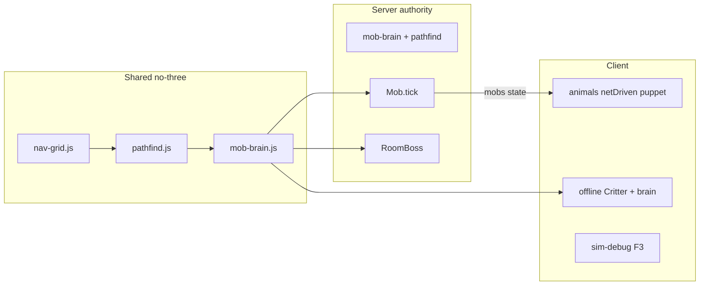

# 世界模拟层（World Sim）

原则：**服务器负责真实状态，客户端负责画面和操作。**

## 权威边界

| 内容 | 单机 | 联机 |
|------|------|------|
| 动物位置 / 状态 | 本地 `mob-brain` | 服务器 `Mob.tick` → `mobs` 广播（含 `state`） |
| Boss | 本地 `chaseStep` | `room-boss.mjs` 权威 |
| 贴地 / A* / 卡住脱困 | 共享 `nav-grid` + `pathfind` | 同左 |
| 画面 / 输入 | 客户端 | 客户端（木偶不推自己 AI） |

## Step 0 完成标准

- [x] `js/nav-grid.js` / `pathfind.js` / `mob-brain.js` / `sim-debug.js`（前三无 three）
- [x] `tests/nav-grid.test.mjs` / `pathfind.test.mjs`
- [x] 服务器 Mob：贴地、A* 游荡/逃跑、卡住脱困；广播 `state`
- [x] 客户端：单机用 brain；联机 `_netDriven` 纯木偶
- [x] Boss（server + 单机 mist）接同一 A* 与卡住
- [x] F3：最近生物碰撞盒 / state / 路径 / 卡住计时

## 明确不做（本阶段）

枪械重做、蓝图领地、权限矩阵、商店/农业/NPC、新怪物种类。

## 后续（只列标题，不实现）

1. Step 1 — 分种行为 / 驯服骨架  
2. Step 2 — 实体避让与群体  
3. Step 3 — 建筑碰撞与蓝图  
4. Step 4 — 战斗状态机扩展  
5. Step 5 — 存档与回放钩子  

## 调试

游戏内按 **F3** 开关 `simDebug`（仅本地叠加层，不改联机协议）。
